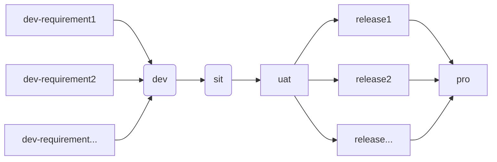

## description

本demo使用`vue3`+`ts`+`pinia`+`antd`+`vue-router`技术，完成**todoList**的demo
***

## link

代码已上传[github](https://github.com/ryntap-vujbu6-wUqxyp/my-vue-app/tree/master);
***

## composition 
**技术选型:**<u>vue3+ts+vite+Pinia+antd+vue-router</u> ~~(vuex)~~

**项目结构**
* public
* src 
    >  +assets
    >  component
    >  router
    >  store
    >  app.vue
    >  main.ts
    >  style.css 
    >  vite-env.d.ts  
* gitigore
* index.html
* package-lock.json 
* package.json 
* README.md 
* tsconfig.json 
* tsconfig.node,json 
* vite.config.ts 
* yarn-error.log 
* yarn.lock 
***

## code snippet
```javascript
$(document).ready(function () {
    alert('测试代码块');  
});
```
***

## picture

***

## git general command
| 说明| git command  |
| :------:| :------:|
| 查看本地代码状态| git status  |
| 撤销提交 回退到上次提交并清除本地提交的代码 | git reset --hard HEAD^ |
| 撤销提交 回退到上次提交不清除本地提交的代码 | git reset --soft HEAD~1 |
| 提交到暂存区 | git add . |
| 提交到提交区域 | git commit -m '提交注释' |
| 拉取当前分支远程代码 | git pull |
| 推送当前分支代码到远程 | git push |
| 创建一个分支 | git branch \<branchName> |
| 删除一个分支 | git branch -d \<branchName> |
| 显示所有分支信息 | git branch -v   |
| 可用于切换分支 | git checkout \<branchName> |
| 创件一个分支并切换 | git checkout -b \<branchName> |
| 在当前分支合并目标分支 | git merge \<branchName> | 
| 将当前更改暂时存入stash | git stash save "save message" | 
| 查看stash了哪些存储 | git stash list  | 
| 应用某个存储,但不会把存储从存储列表中删除 | git stash apply  | 
| 命令恢复之前缓存的工作目录，将缓存堆栈中的对应stash删除 | git stash pop  | 
| 删除所有缓存的stash | git stash clear  | 
***

## git flow流程复习

以往开发首先建立**dev分支**、**sit分支**、**uat分支**,投产上线时会新建**release分支**,将uat分支的内容合并到**release分支**,
再将release分支的内容合并到生产**pro分支**,建立release分支的目的是为了隔离影响,方便修复bug;随着后续版本的增加，
为区分本次上线内容,还会建立新的版本分支dev-requirement1、dev-requirement2 ...   

一般通过两种方式合并代码
* 开发者在本地分支（dev-requirement）拉取远程分支代码后，切换远程sit分支,将本地dev分支修改的内容合并到sit分支，再一步步合并到上线分支
* 开发者提交dev-requirement分支到远程，在gitlab仓库直接发起合并请求,一步步合并到上线分支；


